# tcclanjut minggu-01
# Instalasi Git -01

Melakukan Instalasi Git Di Windows 

1.Yang pertama dilakukan adalah mendownload Git versi Windows di website Git https://git-scm.com/download/win 

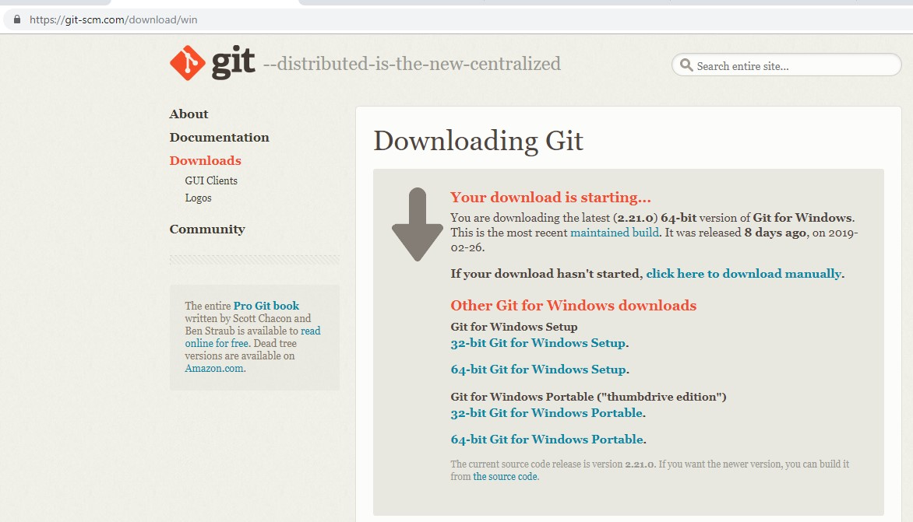
 
2.Setelah itu lakukan instalasi Git ke Perangkat Windows
 
 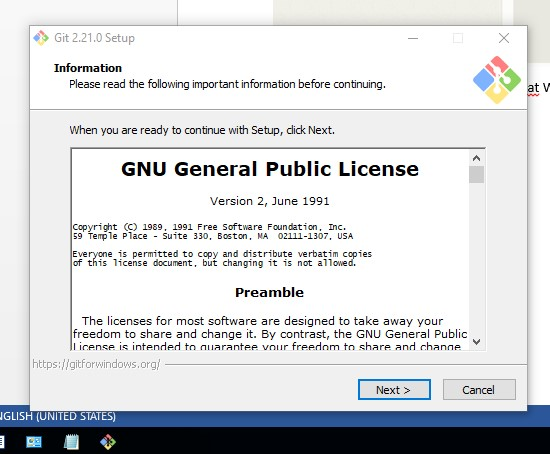
 
3.Kemudian memilih destinasi folder untuk Git

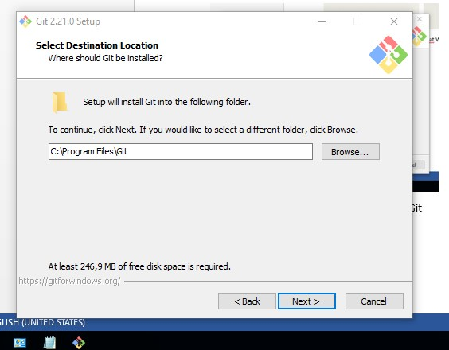

 
4.Kemudian masuk ke pemilihan komponen Git , Note : tidak perlu diubah 

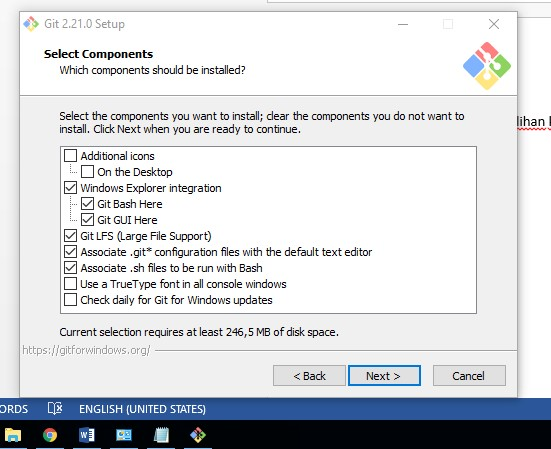
 
5.Menubah Shortcut dari Git sesuai keinginan

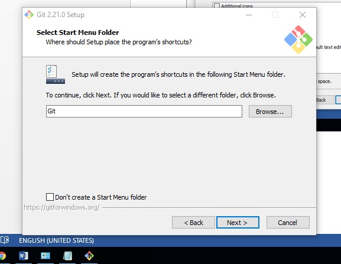

6.Kemudian memilih text editor yang akan digunakan 

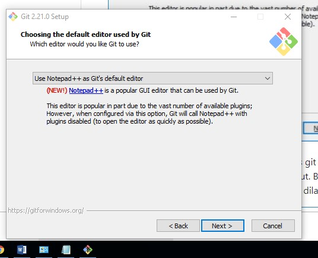
 
7.Memilih OpenSSL untuk HTTPS. Git menggunakan https untuk akes ke repo GitHub kita

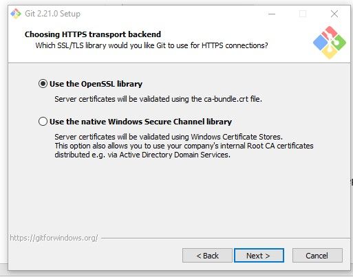
 
8.Pilih pilihan pertama untuk konversi akhir baris (CR-LF)

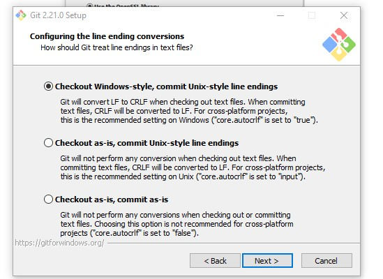
 
9.Memilih PuTTY untuk terminal yang digunakan untuk mengakses Git Bash.

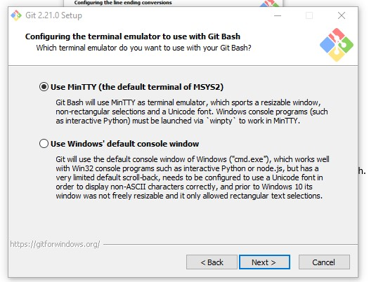
 
10.Untuk opsi tambahan , memilih serta aktifkan 1 dan 2.

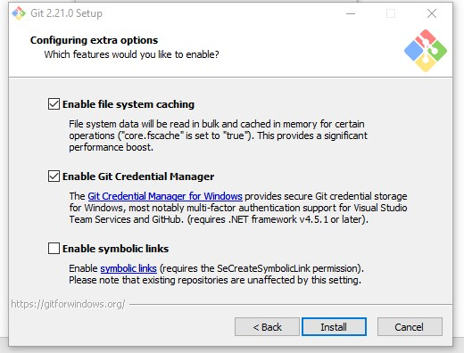
 
11.Kemudian melakukan proses penginstalan 

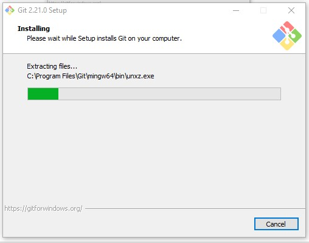
 
12.Setelah penginstalan berhasil 

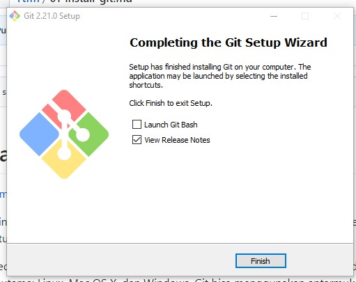
 
13.Kita dapat menjalankan Git Bash dari menu Start

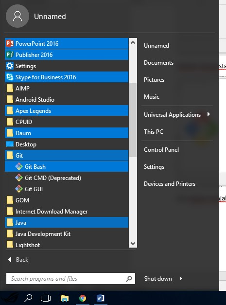
 
14.Tampilan dari Git Bash
 
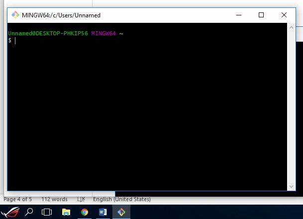
 
15.Dan dibawah adalah tampilan dari Git GUI

 
16.Dan untuk memastikan Git sudah terinstal secara sempurna atau tidak kita bias cek melalui CMD dengan command ‘git –version’
 
 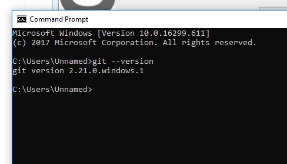
 
 
 Sekian Cara atau Proses Instalisasi Git di Windows 
