# tcclanjut minggu-03
# KATACODA_SCENARIO-03

Deploying Your First Docker Container
 Step 1 of 6 

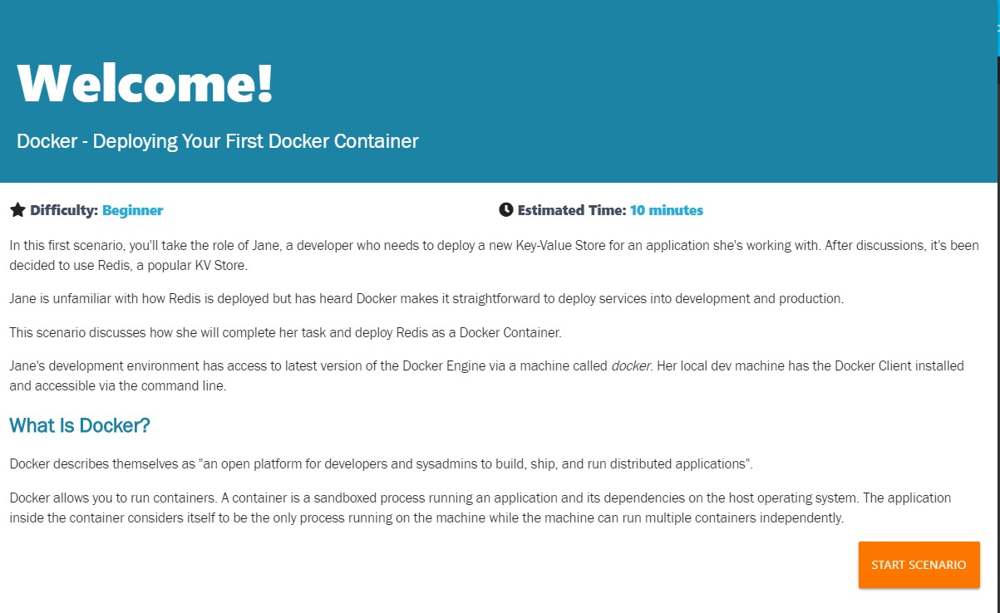

Step 1 - Running A Container
The first task is to identify the name of the Docker Image which is configured to run Redis. With Docker, all containers are started based on a Docker Image. These images contain everything required to launch the process; the host doesn't require any configuration or dependencies.
Jane can find existing images at registry.hub.docker.com/ or by using the command docker search <name>. For example, to find an image for Redis, you would use docker search redis.
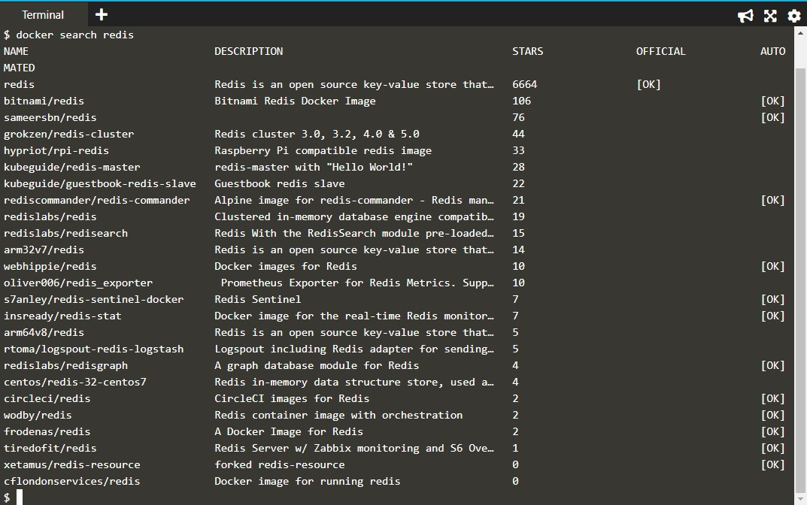

Task
Using the search command, Jane has identified that the RedisDocker Image is called redis and wants to run the latest release. Because Redis is a database, Jane wants to run it as a background service while she continues to work.
To complete this step, launch a container in the background running an instance of Redis based on the official image.
The Docker CLI has a command called run which will start a container based on a Docker Image. The structure is docker run <options> <image-name>.
By default, Docker will run a command in the foreground. To run in the background, the option -d needs to be specified.
docker run -d redis
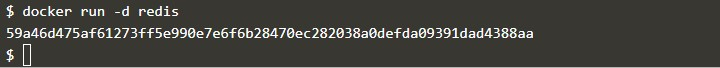

By default, Docker will run the latest version available. If a particular version was required, it could be specified as a tag, for example, version 3.2 would be docker run -d redis:3.2.
As this is the first time Jane is using the Redis image, it will be downloaded onto the Docker Host machine.

 Step 2 of 6 
Step 2 - Finding Running Containers
The launched container is running in the background, the docker ps command lists all running containers, the image used to start the container and uptime.
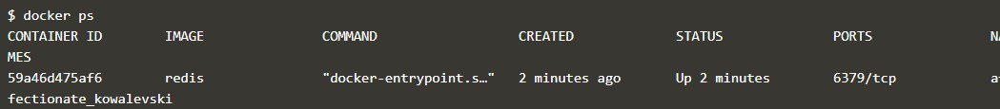

This command also displays the friendly name and ID that can be used to find out information about individual containers.
The command docker inspect <friendly-name|container-id> provides more details about a running container, such as IP address.
The command docker logs <friendly-name|container-id>will display messages the container has written to standard error or standard out.

 Step 3 of 6 
Step 3 - Accessing Redis
Jane is happy that Redis is running, but is surprised that she cannot access it. The reason is that each container is sandboxed. If a service needs to be accessible by a process not running in a container, then the port needs to be exposed via the Host.
Once exposed, it is possible to access the process as if it were running on the host OS itself.
Jane knows that by default, Redis runs on port 6379. She has learned that by default other applications and library expect a Redis instance to be listening on the port.
Task
After reading the documentation, Jane discovers that ports are bound when containers are started using -p <host-port>:<container-port> option. Jane also discovers that it's useful to define a name when starting the container, this means she doesn't have to use Bash piping or keep looking up the name when trying to access the logs.
Jane finds the best way to solve her problem of running Redis in the background, with a name of redisHostPort on port 6379 is using the following command docker run -d --name redisHostPort -p 6379:6379 redis:latest
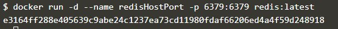

Protip
By default, the port on the host is mapped to 0.0.0.0, which means all IP addresses. You can specify a particular IP address when you define the port mapping, for example, -p 127.0.0.1:6379:6379

 Step 4 of 6 
Step 4 - Accessing Redis
The problem with running processes on a fixed port is that you can only run one instance. Jane would prefer to run multiple Redisinstances and configure the application depending on which port Redis is running on.
Task
After experimenting, Jane discovers that just using the option -p 6379 enables her to expose Redis but on a randomly available port. She decides to test her theory using docker run -d --name redisDynamic -p 6379 redis:latest

While this works, she now doesn't know which port has been assigned. Thankfully, this is discovered via docker port redisDynamic 6379

Jane also finds that listing the containers displays the port mapping information, docker ps
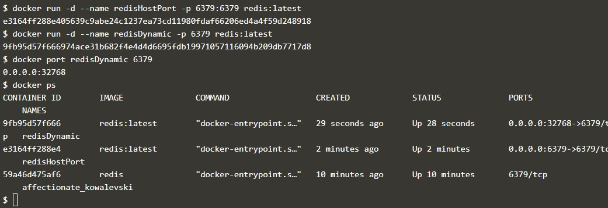

 Step 5 of 6 
Step 5 - Persisting Data
After working with containers for a few days, Jane realises that the data stored keeps being removed when she deletes and re-creates a container. Jane needs the data to be persisted and reused when she recreates a container.
Containers are designed to be stateless. Binding directories (also known as volumes) is done using the option -v <host-dir>:<container-dir>. When a directory is mounted, the files which exist in that directory on the host can be accessed by the container and any data changed/written to the directory inside the container will be stored on the host. This allows you to upgrade or change containers without losing your data.
Task
Using the Docker Hub documentation for Redis, Jane has investigated that the official Redis image stores logs and data into a /data directory.
Any data which needs to be saved on the Docker Host, and not inside containers, should be stored in /opt/docker/data/redis.
The complete command to solve the task is docker run -d --name redisMapped -v /opt/docker/data/redis:/data redis
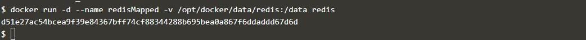

Protip
Docker allows you to use $PWD as a placeholder for the current directory.

 Step 6 of 6 
Step 6 - Running A Container In The Foreground
Jane has been working with Redis as a background process. Jane wonders how containers work with foreground processes, such as ps or bash.
Previously, Jane used the -d to execute the container in a detached, background, state. Without specifying this, the container would run in the foreground. If Jane wanted to interact with the container (for example, to access a bash shell) she could include the options -it.
As well as defining whether the container runs in the background or foreground, certain images allow you to override the command used to launch the image. Being able to replace the default command makes it possible to have a single image that can be re-purposed in multiple ways. For example, the Ubuntu image can either run OS commands or run an interactive bash prompt using /bin/bash
Example
The command docker run ubuntu ps launches an Ubuntu container and executes the command ps to view all the processes running in a container.
Using docker run -it ubuntu bash allows Jane to get access to a bash shell inside of a container.
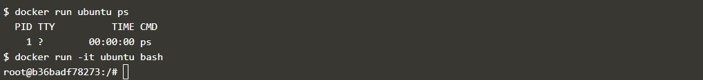

Deploy Static HTML Website as Container
 Step 1 of 3 
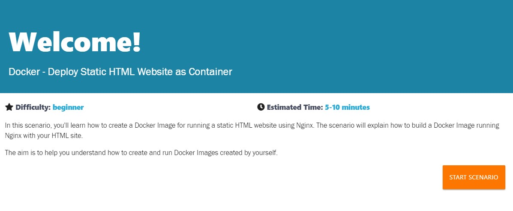

Step 1 - Create Dockerfile
Docker Images start from a base image. The base image should include the platform dependencies required by your application, for example, having the JVM or CLR installed.
This base image is defined as an instruction in the Dockerfile. Docker Images are built based on the contents of a Dockerfile. The Dockerfile is a list of instructions describing how to deploy your application.
In this example, our base image is the Alpine version of Nginx. This provides the configured web server on the Linux Alpine distribution.
Task
Create your Dockerfile for building your image by copying the contents below into the editor.
FROM nginx:alpine
COPY . /usr/share/nginx/html

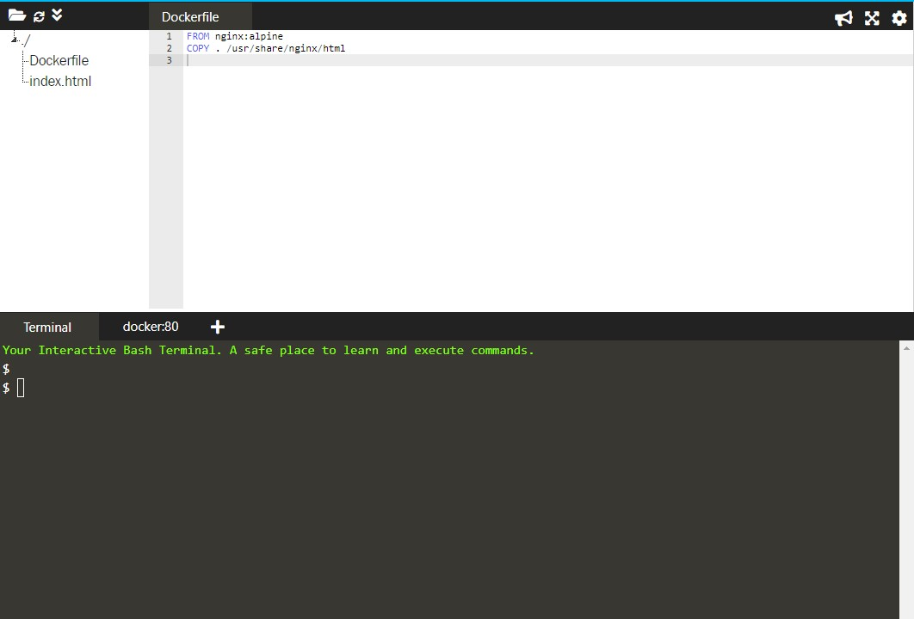

The first line defines our base image. The second line copies the content of the current directory into a particular location inside the container.

 Step 2 of 3 
Step 2 - Build Docker Image
The Dockerfile is used by the Docker CLI build command. The buildcommand executes each instruction within the Dockerfile. The result is a built Docker Image that can be launched and run your configured app.
The build command takes in some different parameters. The format is docker build -t <build-directory>. The -t parameter allows you to specify a friendly name for the image and a tag, commonly used as a version number. This allows you to track built images and be confident about which version is being started.
Task
Build our static HTML image using the build command below.
docker build -t webserver-image:v1 .
You can view a list of all the images on the host using docker images.
The built image will have the name webserver-image with a tag of v1.
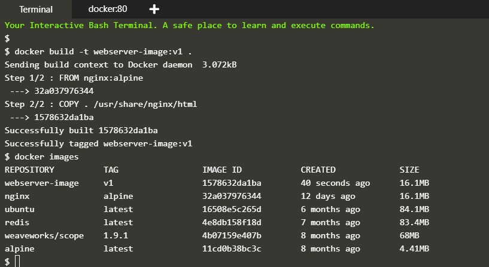

 Step 3 of 3 
Step 3 - Run
The built Image can be launched in a consistent way to other Docker Images. When a container launches, it's sandboxed from other processes and networks on the host. When starting a container you need to give it permission and access to what it requires.
For example, to open and bind to a network port on the host you need to provide the parameter -p <host-port>:<container-port>.
Task
Launch our newly built image providing the friendly name and tag. As it's a web server, bind port 80 to our host using the -p parameter.
docker run -d -p 80:80 webserver-image:v1
Once started, you'll be able to access the results of port 80 via curl docker

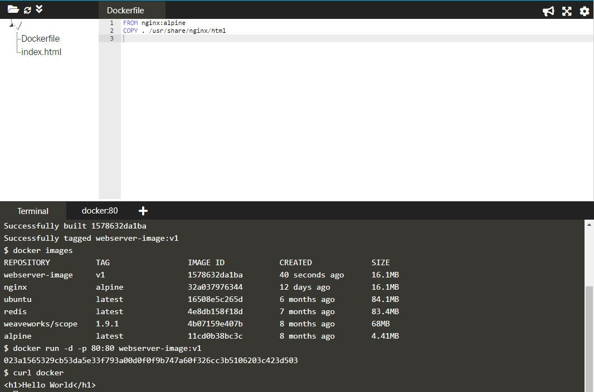

To render the requests in the browser use the following links
https://2886795307-80-cykoria03.environments.katacoda.com/
You now have a static HTML website being served by Nginx.

Building Container Images
 Step 1 of 6 
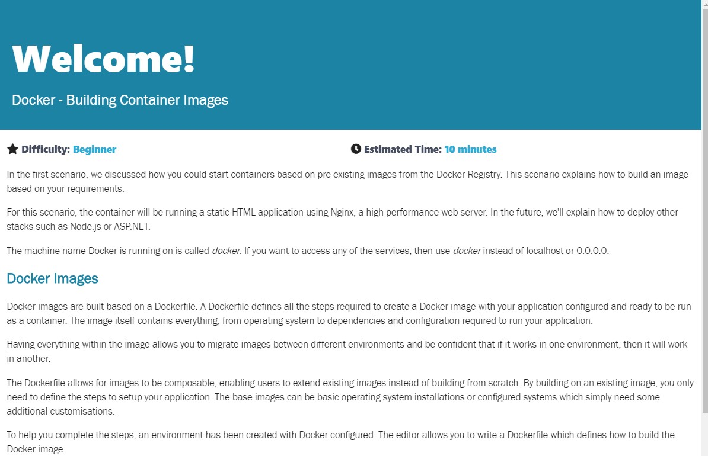

Step 1 - Base Images
All Docker images start from a base image. A base image is the same images from the Docker Registry which are used to start containers. Along with the image name, we can also include the image tag to indicate which particular version we want, by default, this is latest.
These base images are used as the foundation for your additional changes to run your application. For example, in this scenario, we require NGINX to be configured and running on the system before we can deploy our static HTML files. As such we want to use NGINX as our base image.
Dockerfile's are simple text files with a command on each line. To define a base image we use the instruction FROM <image-name>:<tag>
Task: Creating a Dockerfile
The first line of the Dockerfile should be FROM nginx:1.11-alpine
Make the change in the Dockerfile editor. Within the environment, a new Dockerfile will be created with the contents of the editor.
Caution
It's tempting to use the tag :latest however this can result in you building your image against a version which you were not expecting. We recommend that you always use a particular version number as your tag and manage the updating yourself.

 Step 1 of 6 
Step 1 - Base Images
FROM nginx:1.11-alpine

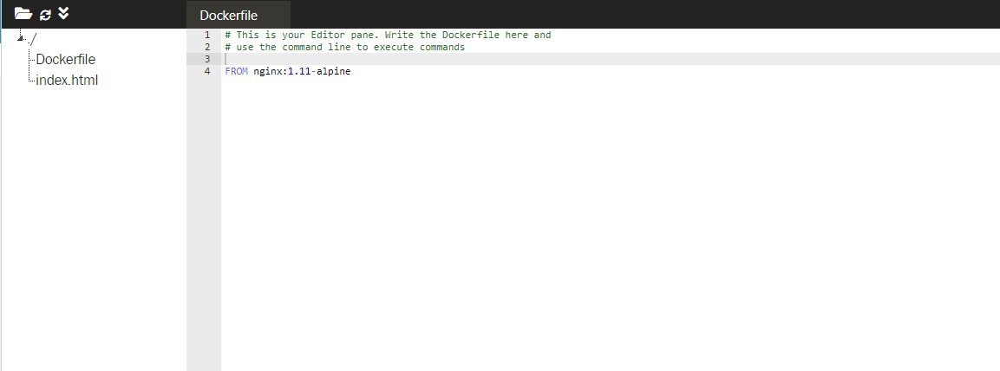

 Step 2 of 6 
Step 2 - Running Commands
With the base image defined, we need to run various commands to configure our image. There are many commands to help with this, the main commands two are COPY and RUN.
RUN <command> allows you to execute any command as you would at a command prompt, for example installing different application packages or running a build command. The results of the RUN are persisted to the image so it's important not to leave any unnecessary or temporary files on the disk as these will be included in the image.
COPY <src> <dest> allows you to copy files from the directory containing the Dockerfile to the container's image. This is extremely useful for source code and assets that you want to be deployed inside your container.
Task
A new index.html file has been created for you which we want to serve from our container. On the next line after the FROM command, use the COPY command to copy index.html into a directory called /usr/share/nginx/html
Protip
If you're copying a file into a directory then you need to specify the filename as part of the destination.

 Step 2 of 6 
Step 2 - Running Commands
COPY index.html /usr/share/nginx/html/index.html

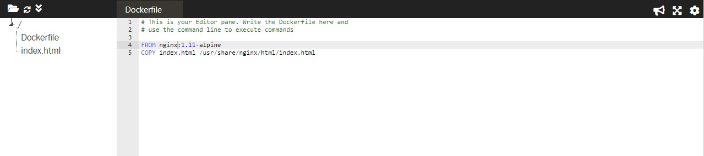

 Step 3 of 6 
Step 3 - Exposing Ports
With our files copied into our image and any dependencies downloaded, you need to define which port application needs to be accessible on.
Using the EXPOSE <port> command you tell Docker which ports should be open and can be bound too. You can define multiple ports on the single command, for example, EXPOSE 80 433 or EXPOSE 7000-8000
Task
We want our web server to be accessible via port 80, add the relevant EXPOSE line to the Dockerfile.
 Step 3 of 6 
Step 3 - Exposing Ports
EXPOSE 80

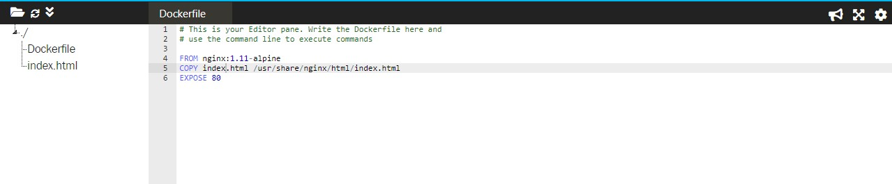

 Step 4 of 6 
Step 4 - Default Commands
With the Docker image configured and having defined which ports we want accessible, we now need to define the command that launches the application.
The CMD line in a Dockerfile defines the default command to run when a container is launched. If the command requires arguments then it's recommended to use an array, for example ["cmd", "-a", "arga value", "-b", "argb-value"], which will be combined together and the command cmd -a "arga value" -b argb-valuewould be run.
Task
The command to run NGINX is nginx -g daemon off;. Set this as the default command in the Dockerfile.
Protip
An alternative approach to CMD is ENTRYPOINT. While a CMD can be overridden when the container starts, a ENTRYPOINT defines a command which can have arguments passed to it when the container launches.
In this example, NGINX would be the entrypoint with -g daemon off; the default command.
 Step 4 of 6 
Step 4 - Default Commands
CMD ["nginx", "-g", "daemon off;"]

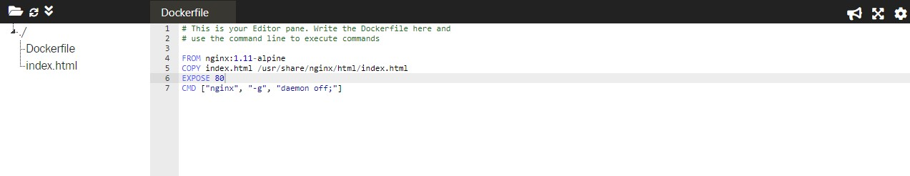

 Step 5 of 6 
Step 5 - Building Containers
After writing your Dockerfile you need to use docker build to turn it into an image. The build command takes in a directory containing the Dockerfile, executes the steps and stores the image in your local Docker Engine. If one fails because of an error then the build stops.
Task
Using the docker build command to build the image. You can give the image a friendly name by using the -t <name> option.
Protip
You can use docker images to see a list of the images on your local machine.

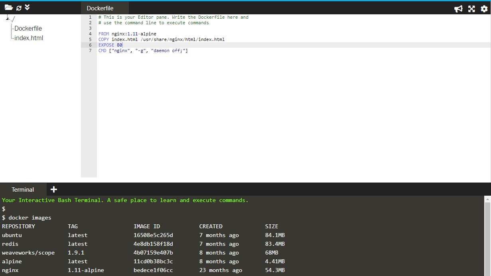
 Step 5 of 6 
Step 5 - Building Containers
docker build -t my-nginx-image:latest .

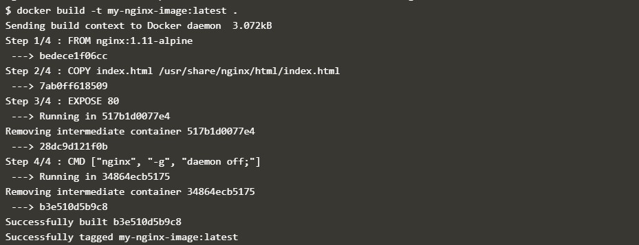

And Image updated

 Step 6 of 6 
Step 6 - Launching New Image
With the image successfully created, you can now launch the container in the same way we described in the first scenario.
Task
Launch an instance of your newly built image using either the ID result from the build command or the friendly name you assigned it.
NGINX is designed to run as a background service so you should include the option -d. To make the web server accessible, bind it to port 80 using p 80:80
For example:
docker run -d -p 80:80 <image-id|friendly-tag-name>
You can access the launched web server via the hostname docker. After launching the container, the command curl -i http://docker will return our index file via NGINX and the image we built.
Protip
You can check the container is running using docker ps
 Step 6 of 6 
Step 6 - Launching New Image
docker run -d -p 80:80 my-nginx-image:latest

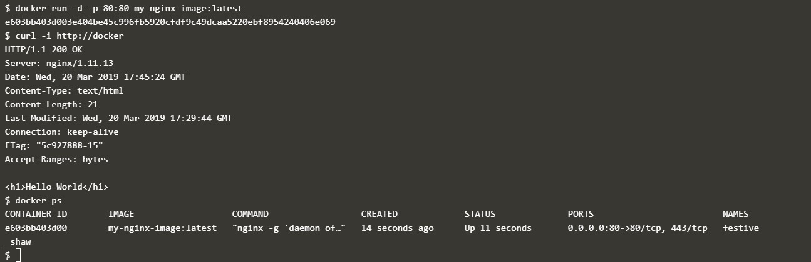

