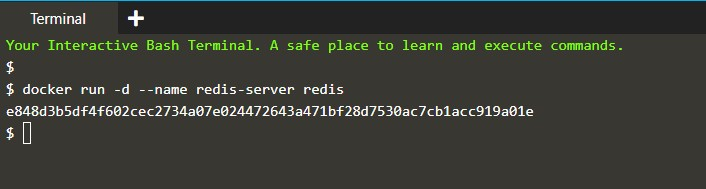
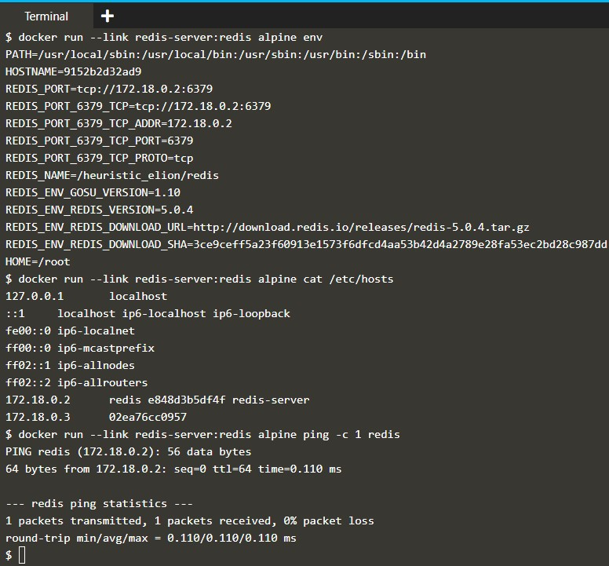
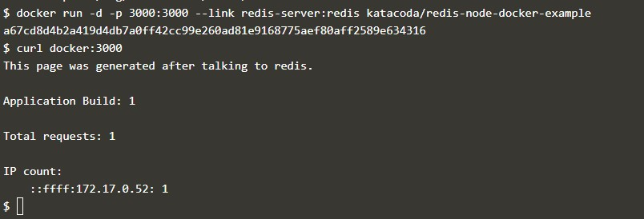
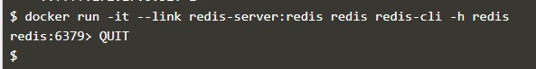

#Docker - Communicating Between Containers

> Step 1 - Start Redis

Skenario yang paling umum untuk menghubungkan ke Kontainer adalah aplikasi yang menghubungkan ke penyimpanan data. Aspek kunci saat membuat Link adalah nama Kontainer. Semua Kontainer memiliki nama, tetapi untuk membuatnya lebih mudah ketika bekerja dengan Link, penting untuk menentukan nama yang mudah dari sumber Kontainer yang Anda sambungkan.

> Start Data Store

Jalankan server redis dengan nama simple redis-server yang akan kita sambungkan pada langkah berikutnya. Ini akan menjadi sumber Kontainer kita

 ```docker run -d --name redis-server redis```




> Step 2 - Create Link

Untuk menghubungkan ke sumber Kontainer , Anda menggunakan opsi --link <container-name | id>: <alias> saat meluncurkan Kontainer baru. Nama kontainer merujuk ke sumber kontainer yang kami tentukan di langkah sebelumnya sementara alias mendefinisikan nama host yang ramah.

Dengan mengatur alias kita memisahkan bagaimana aplikasi kita dikonfigurasi dengan bagaimana infrastruktur dipanggil. Ini berarti konfigurasi aplikasi tidak perlu diubah karena terhubung ke lingkungan lain.

> How Links Work

Pertama, Docker akan menetapkan beberapa variabel lingkungan berdasarkan yang ditautkan ke Kontainer. Variabel lingkungan ini memberi Anda cara untuk referensi informasi seperti Port dan alamat IP melalui nama yang dikenal.

Anda dapat menampilkan semua variabel lingkungan dengan perintah env. Sebagai contoh:

```docker run --link redis-server:redis alpine env```

Kedua, Docker akan memperbarui file HOSTS Kontainer dengan entri untuk sumber Kontainer kami dengan tiga nama, asli, alias dan hash-id. Anda dapat menampilkan entri host kontainer menggunakan cat / etc / hosts

```docker run --link redis-server:redis alpine cat /etc/hosts```

> Example

Dengan link yang dibuat, Anda dapat melakukan ping sumber Kontainer dengan cara yang sama seolah-olah itu server yang berjalan di jaringan Anda

```docker run --link redis-server:redis alpine ping -c 1 redis```




> Step 3 - Connect To App

Dengan Link yang dibuat, aplikasi dapat terhubung dan berkomunikasi dengan  sumber Kontainer dengan cara biasa, terlepas dari kenyataan bahwa kedua layanan berjalan dalam Kontainer.

Example Application

Berikut adalah aplikasi node.js sederhana yang terhubung ke redis menggunakan redis hostname.

```docker run -d -p 3000:3000 --link redis-server:redis katacoda/redis-node-docker-example```

> Test Connection

Mengirim permintaan HTTP ke aplikasi akan menyimpan permintaan di Redis dan mengembalikan hitungan. Jika Anda mengeluarkan beberapa permintaan, Anda akan melihat kenaikan penghitung saat item tetap ada.

```curl docker:3000```




> Step 4 - Connect to Redis CLI

Dengan cara yang sama, Anda dapat menghubungkan sumber Kontainer ke aplikasi, Anda juga dapat menghubungkannya dengan alat CLI mereka sendiri.

> Launching Redis CLI

Perintah di bawah ini akan meluncurkan sebuah instance dari alat Redis-cli dan terhubung ke server redis melalui aliasnya.

```docker run -it --link redis-server:redis redis redis-cli -h redis```

> Issuing Commands

Perintah KEYS * akan menampilkan konten yang disimpan saat ini dalam sumber Kontainer  redis.

Ketik ```QUIT``` untuk keluar dari CLI.




