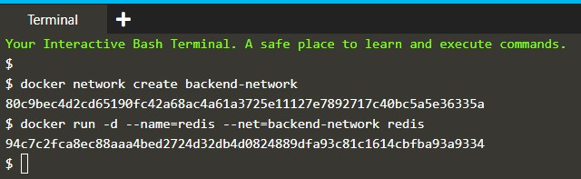
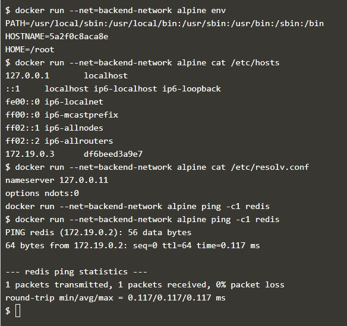
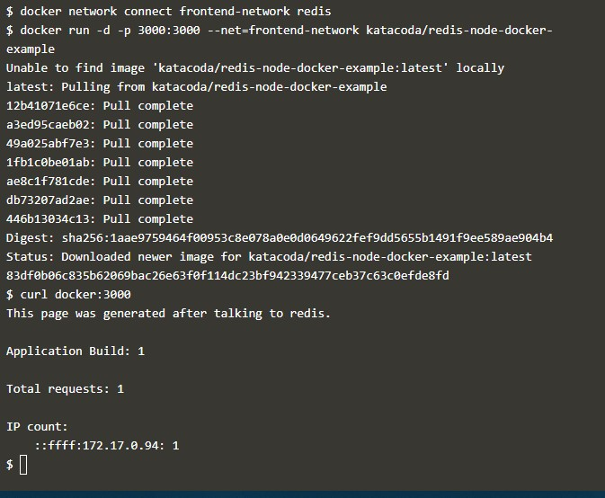
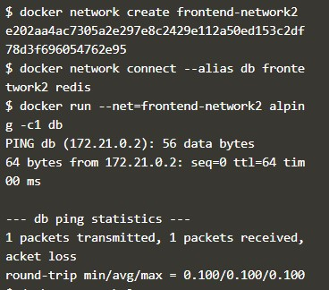
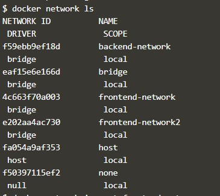
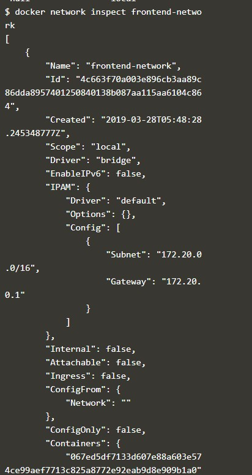
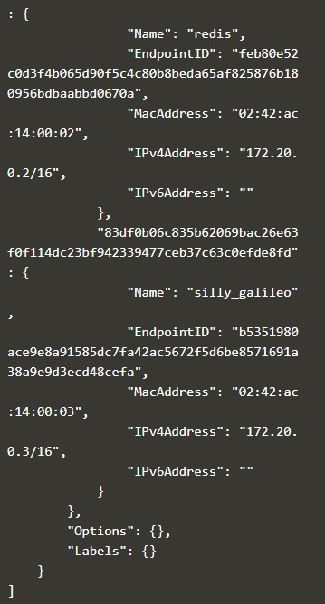
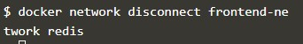

#Docker - Docker Networks

> Step 1 - Create Network

Langkah pertama adalah membuat jaringan menggunakan CLI. Jaringan ini akan memungkinkan kami untuk melampirkan banyak Kontainer yang dapat saling menemukan.

Dalam contoh ini, kita akan mulai dengan membuat jaringan backend. Semua kontainer yang melekat pada backend kami akan berada di jaringan ini.

> Task: Create Network

Untuk memulai, kami membuat jaringan dengan nama yang telah ditentukan sebelumnya.

```docker network create backend-network```

> Task: Connect To Network

Saat kami meluncurkan kontainer baru, kami dapat menggunakan atribut --net untuk menetapkan jaringan mana yang harus dihubungkan.

```docker run -d --name=redis --net=backend-network redis```

Pada langkah selanjutnya kita akan menjelajahi kondisi jaringan.




> Step 2 - Network Communication

Tidak seperti menggunakan tautan, jaringan Docker berperilaku seperti jaringan tradisional tempat nodes dapat dilampirkan / dilepaskan.

> Task: Explore

Hal pertama yang akan Anda perhatikan adalah bahwa Docker tidak lagi menetapkan variabel lingkungan atau memperbarui file host dari Kontainer. Jelajahi menggunakan dua perintah berikut dan Anda akan melihatnya tidak lagi menyebutkan Kontainer lain.

```docker run --net=backend-network alpine env```

```docker run --net=backend-network alpine cat /etc/hosts```

Alih-alih, cara Kontainer dapat berkomunikasi melalui Server DNS Tertanam di Docker. Server DNS ini ditugaskan untuk semua kontainer melalui IP 127.0.0.11 dan diatur dalam file resolv.conf.

```docker run --net=backend-network alpine cat /etc/resolv.conf```

Ketika kontainer mencoba mengakses kontainer lain melalui nama yang terkenal, seperti Redis, server DNS akan mengembalikan alamat IP kontainer yang benar. Dalam hal ini, nama Redis yang sepenuhnya memenuhi syarat adalah redis.backend-network.

```docker run --net=backend-network alpine ping -c1 redis```




> Step 3 - Connect Two Containers

Docker mendukung beberapa jaringan dan kontainer yang terhubung ke lebih dari satu jaringan sekaligus.

Sebagai contoh, mari kita buat jaringan terpisah dengan aplikasi Node.js yang berkomunikasi dengan instance Redis yang ada.

> Task

Tugas pertama adalah membuat jaringan baru dengan cara yang sama.

```docker network create frontend-network```

Saat menggunakan perintah hubungkan, dimungkinkan untuk melampirkan Kontainer yang ada ke jaringan.

```docker network connect frontend-network redis```

Ketika kita meluncurkan server web, mengingat itu terlampir pada jaringan yang sama itu akan dapat berkomunikasi dengan instance dari Redis.

```docker run -d -p 3000:3000 --net=frontend-network katacoda/redis-node-docker-example```

kita dapat mengujinya menggunakan :

```curl docker:3000```




> Step 4 - Create Aliases

Link masih didukung saat menggunakan jaringan Docker dan menyediakan cara untuk mendefinisikan Alias dengan nama kontainer. Ini akan memberi kontainer nama entri DNS tambahan dan cara untuk ditemukan. Saat menggunakan --link, DNS yang tertanam akan menjamin bahwa hasil pencarian yang dilokalkan hanya pada kontainer itu di mana --link digunakan.

Pendekatan lain adalah memberikan alias saat menghubungkan kontainer ke jaringan.

> Connect Container with Alias

Perintah berikut akan menghubungkan instance Redis ke jaringan frontend dengan alias dari db.

```docker network create frontend-network2``` 
```docker network connect --alias db frontend-network2 redis```

Ketika kontainer mencoba mengakses layanan melalui nama db, mereka akan diberi alamat IP dari kontainer Redis redis.

```docker run --net=frontend-network2 alpine ping -c1 db```




> Step 5 - Disconnect Containers

Dengan jaringan yg kita dibuat, kita dapat menggunakan CLI untuk menjelajahi detailnya.

Perintah berikut akan mencantumkan semua jaringan di host kita.

```docker network ls```




Kita kemudian dapat menjelajahi jaringan untuk melihat Kontainer mana yang dilampirkan dan alamat IP mereka.

```docker network inspect frontend-network```





Perintah berikut ini memutus kontainer redis dari jaringan frontend.

```docker network disconnect frontend-network redis```



