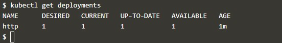

## Start containers using Kubectl


> Step 1 - Launch Cluster

Untuk memulai, kita perlu meluncurkan cluster Kubernetes.

Jalankan perintah di bawah ini untuk memulai komponen kluster dan unduh Kubectl CLI.

 ```minikube start```

 

 Tunggu sampai Node menjadi Siap dengan memeriksa

 ```kubectl get nodes```

  

  > Step 2 - Kubectl Run

 Perintah run membuat penyebaran berdasarkan parameter yang ditentukan, seperti gambar atau replika. Penempatan ini dikeluarkan untuk master Kubernetes yang meluncurkan Pods dan kontainer yang diperlukan. Kubectl run_ mirip dengan docker run tetapi pada level cluster.

Format perintahnya adalah kubectl run <name of deployment> <properties>

 > Tugas : 


Perintah berikut akan meluncurkan penyebaran yang disebut http yang akan memulai sebuah kontainer berdasarkan Docker Image katacoda / docker-http-server: latest.

 ```kubectl run http --image=katacoda/docker-http-server:latest --replicas=1```

 

 Anda kemudian dapat menggunakan kubectl untuk melihat status penyebaran

 ```kubectl get deployments```

 

 Untuk mencari tahu apa yang dibuat Kubernetes, Anda bisa mendeskripsikan proses penyebaran.

 ```kubectl describe deployment http```

 

 eskripsi termasuk berapa banyak replika yang tersedia, label yang ditentukan dan peristiwa yang terkait dengan penyebaran. Peristiwa ini akan menyoroti masalah dan kesalahan yang mungkin terjadi.

Pada langkah berikutnya kita akan mengekspos layanan yang sedang berjalan.

> Step 3 - Kubectl Expose

 
Dengan penyebaran yang dibuat, kita dapat menggunakan kubectl untuk membuat layanan yang memaparkan Pods pada port tertentu.

Paparkan penyebaran http yang baru dikerahkan via kubectl expose. Perintah ini memungkinkan Anda untuk menentukan berbagai parameter layanan dan cara mengekspos penyebaran.

 > Tugas : 


Gunakan perintah berikut untuk mengekspos port kontainer 80 pada host 8000 yang mengikat ip eksternal host.

 ```kubectl expose deployment http --external-ip="172.17.0.24" --port=8000 --target-port=80```

 

 Anda kemudian dapat melakukan ping host dan melihat hasilnya dari layanan HTTP.

 ```curl http://172.17.0.24:8000```

 

 
 > Step 4 - Kubectl Run and Expose

 
Dengan menjalankan kubectl dimungkinkan untuk membuat penyebaran dan mengeksposnya sebagai satu perintah.

 > Tugas : 


Gunakan perintah perintah untuk membuat layanan http kedua yang terbuka di port 8001.

 ```kubectl run httpexposed --image=katacoda/docker-http-server:latest --replicas=1 --port=80 --hostport=8001```

 

 Anda harus dapat mengaksesnya menggunakan

 ```curl http://172.17.0.25:8001```

 

 Di bawah penutup, ini memperlihatkan Pod via Docker Port Mapping. Akibatnya, Anda tidak akan melihat layanan terdaftar menggunakan

  ```kubectl get svc```

  

Untuk menemukan detail yang bisa Anda gunakan

 ```docker ps | grep httpexposed```

 

> Pause Containers : 

Menjalankan perintah di atas Anda akan melihat port terbuka di Pod, bukan kontainer http itu sendiri. Wadah Jeda bertanggung jawab untuk menentukan jaringan untuk Pod. Wadah lain di pod berbagi namespace jaringan yang sama. Ini meningkatkan kinerja jaringan dan memungkinkan banyak kontainer untuk berkomunikasi melalui antarmuka jaringan yang sama ..

 > Step 5 - Scale Containers

 
Dengan menjalankan penyebaran , kita sekarang dapat menggunakan kubectl untuk mengukur jumlah replika.

Melakukan penskalaan penyebaran akan meminta Kubernetes untuk meluncurkan Pod tambahan. Pod ini kemudian akan secara otomatis dimuat seimbang menggunakan Layanan yang terbuka.

 > Tugas : 


Skala perintah kubectl memungkinkan kita untuk menyesuaikan jumlah Pods yang berjalan untuk pengendali penempatan atau replikasi tertentu.

 ```kubectl scale --replicas=3 deployment http```

 

 Mendaftar semua pod, Anda akan melihat tiga berjalan untuk penyebaran http

 ```kubectl get pods```

 

 
Setelah setiap Pod dimulai, ia akan ditambahkan ke layanan penyeimbang beban. Dengan menjelaskan layanan, Anda dapat melihat titik akhir dan Pod terkait yang disertakan.

  ```kubectl describe svc http```

  

Membuat permintaan ke layanan akan meminta di beberapa node memproses permintaan tersebut.

 ```curl http://172.17.0.25:8000```

 

 


 * [<<= Back](README.md)