## Deploy Containers Using YAML


> Step 1 - Create Deployment

Salah satu objek Kubernetes yang paling umum adalah objek penyebaran. Objek penyebaran mendefinisikan spesifikasi kontainer yang diperlukan, bersama dengan nama dan label yang digunakan oleh bagian lain dari Kubernetes untuk menemukan dan menghubungkan ke aplikasi.

 > Tugas : 


Salin definisi berikut ke editor. Definisi tersebut mendefinisikan cara meluncurkan aplikasi yang disebut webapp1 menggunakan Docker Image katacoda / docker-http-server yang berjalan pada Port 80.


 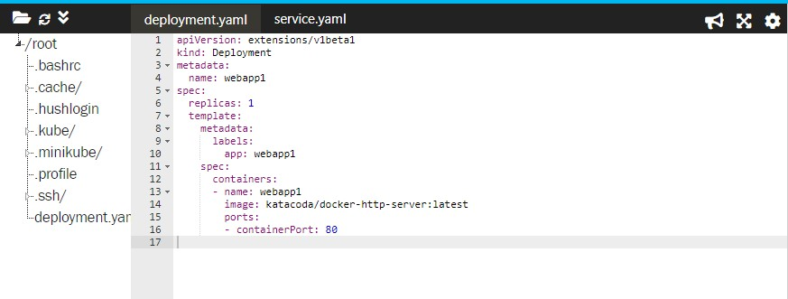

 Ini digunakan untuk cluster dengan perintah

 ```kubectl create -f deployment.yaml```

 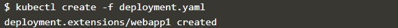

 Karena ini adalah objek Penerapan, daftar semua objek yang digunakan dapat diperoleh melalui

 ```kubectl get deployment```

 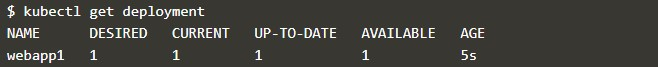

 Detail dari masing-masing penyebaran dapat ditampilkan

 ```kubectl describe deployment webapp1```

  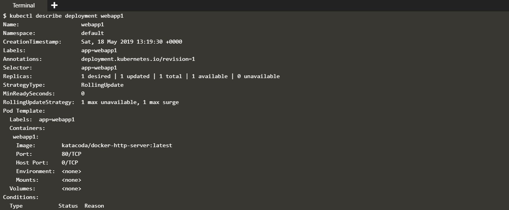


> Step 2 - Create Service

Kubernetes memiliki kemampuan jaringan yang kuat yang mengontrol cara aplikasi berkomunikasi. Konfigurasi jaringan ini juga dapat dikontrol melalui YAML.


 > Tugas : 


Salin definisi Layanan ke editor. Layanan memilih semua aplikasi dengan label webapp1. Saat banyak replika, atau contoh, ditempatkan, mereka akan secara otomatis memuat seimbang berdasarkan label umum ini. Layanan menyediakan aplikasi melalui NodePort.


 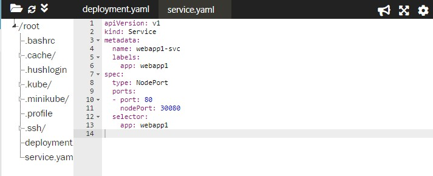

 Semua objek Kubernetes dikerahkan secara konsisten menggunakan kubectl.

Menyebarkan Layanan dengan cara

 ```kubectl create -f service.yaml```

 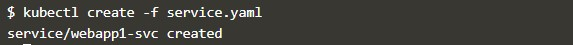

 Seperti sebelumnya, detail semua objek Layanan yang dikerahkan dengan ```kubectl get svc```
 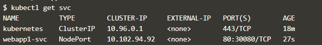

Dengan menjelaskan objek, Anda dapat menemukan detail lebih lanjut tentang konfigurasi

 ```kubectl describe svc webapp1-svc.```

 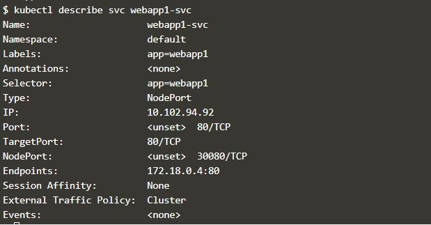


 ```curl host01:30080```

  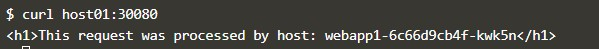


 
 > Step 3 - Scale Deployment

Rincian YAML dapat diubah karena konfigurasi yang berbeda diperlukan untuk penerapan. Ini mengikuti infrastruktur sebagai pola pikir kode. Manifes harus disimpan di bawah kendali sumber dan digunakan untuk memastikan bahwa konfigurasi dalam produksi cocok dengan konfigurasi dalam kontrol sumber.


 > Tugas : 


Perbarui file deployment.yaml untuk meningkatkan jumlah instance yang berjalan. Misalnya, file tersebut akan terlihat seperti ini:

 ```replicas: 4```

 Pembaruan definisi yang ada diterapkan menggunakan kubectl apply. Untuk skala jumlah replika, gunakan file YAML yang diperbarui menggunakan

 ```kubectl apply -f deployment.yaml```

 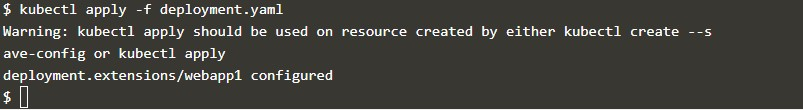

 Seketika, keadaan yang diinginkan dari kluster kami telah diperbarui, dapat dilihat dengan

 ```kubectl get deployment```

 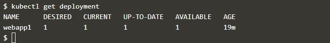

Pod tambahan akan dijadwalkan agar sesuai dengan permintaan

 ```kubectl get pods```

 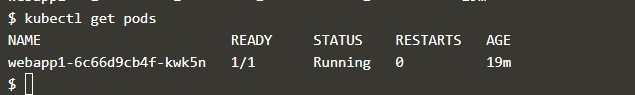

 Karena semua Pods memiliki pemilih label yang sama, mereka akan dimuat dengan seimbang di belakang Service NodePort yang digunakan.

Mengeluarkan permintaan ke pelabuhan akan menghasilkan berbagai kontainer memproses permintaan


 ```curl host01:30080```

  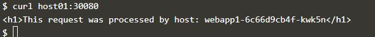

  Rincian Jaringan Kubernetes tambahan dan Definisi Objek akan dibahas dalam skenario mendatang.25

 


 * [<<= Back](README.md)